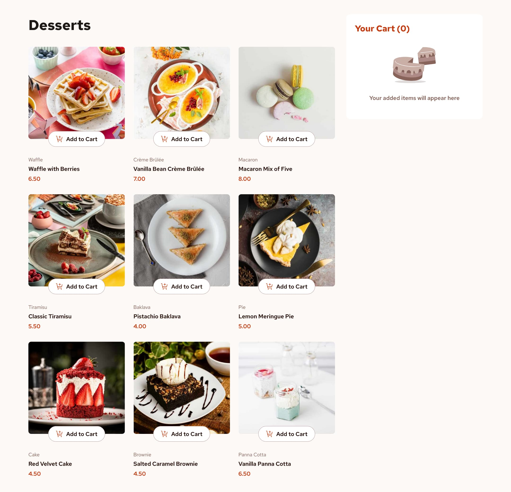
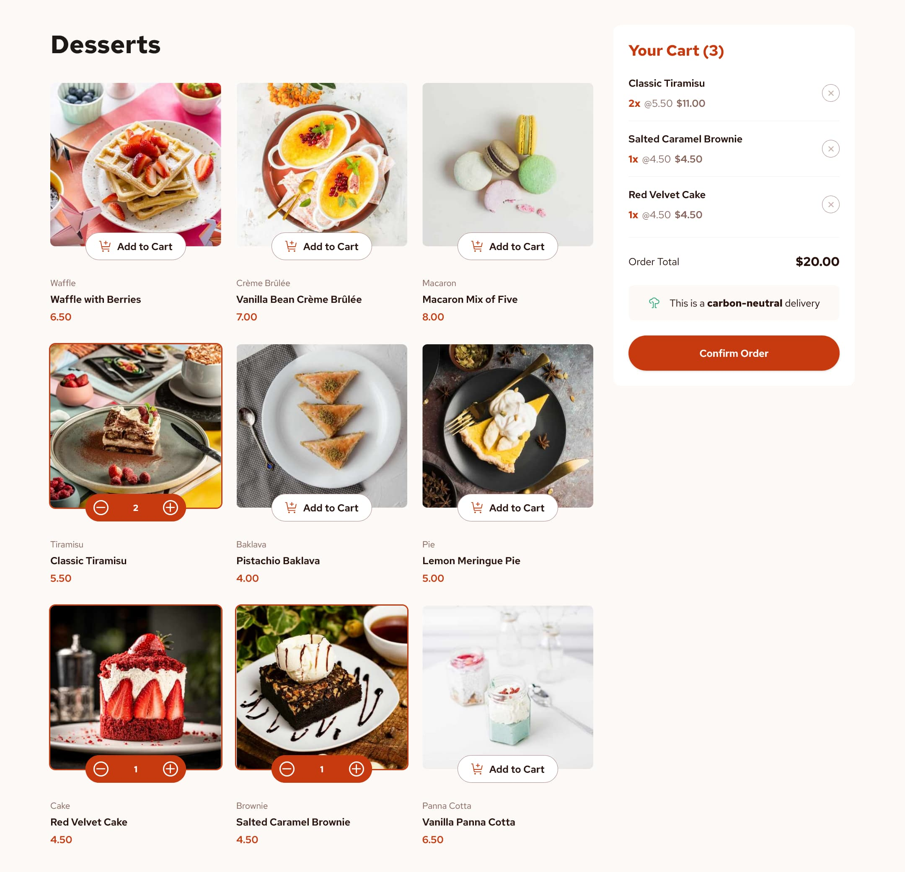
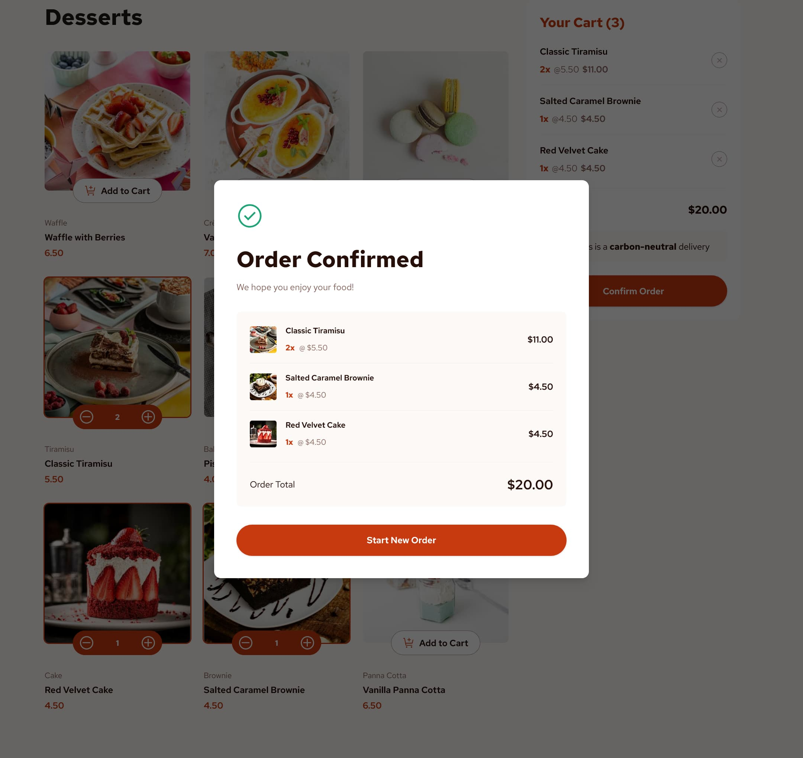

# Product List with Cart

A responsive, interactive React application that simulates a product ordering experience for a café-style dessert menu. Users can browse a grid of dessert items, add items to a dynamic shopping cart, adjust quantities, and confirm their order. 

Design and base project requirments sourced from the [Product list with cart challenge on Frontend Mentor](https://www.frontendmentor.io/challenges/product-list-with-cart-5MmqLVAp_d).

## Table of contents

- [Overview](#overview)
  - [The challenge](#the-challenge)
  - [Screenshots](#screenshots)
  - [Links](#links)
- [My process](#my-process)
  - [Built with](#built-with)
  - [Spotlight](#spotlight)
  - [Useful resources](#useful-resources)
- [Author](#author)
- [Acknowledgments](#acknowledgments)


## Overview

### The challenge

Users should be able to:

- Add items to the cart and remove them
- Increase/decrease the number of items in the cart
- See an order confirmation modal when they click "Confirm Order"
- Reset their selections when they click "Start New Order"
- View the optimal layout for the interface depending on their device's screen size
- See hover and focus states for all interactive elements on the page

### Screenshots








### Links

- [Frontend Mentor solution page](https://your-solution-url.com)
- [live demo site](https://product-list-desserts.netlify.app/)

## My process

### Built with

- Semantic HTML and WAI-ARIA best practices
- Modern CSS Grid and Flexbox solutions
- Mobile-first workflow
- [TailwindCSS](https://tailwindcss.com/) - CSS framework
- [React](https://reactjs.org/) - JS library
- Vite


### Spotlight

The design starter files from Frontend Mentor include multiple image versions for each menu product item. To more easily leverage Vite's image optimization, I refactored the provided JSON file to allow for imports of each product's assorted images.

```js
// Waffle
import waffleThumb from '../assets/images/image-waffle-thumbnail.jpg';
import waffleMobile from '../assets/images/image-waffle-mobile.jpg';
import waffleTablet from '../assets/images/image-waffle-tablet.jpg';
import waffleDesktop from '../assets/images/image-waffle-desktop.jpg';
...

export const products = [
  {
    name: "Waffle with Berries",
    category: "Waffle",
    price: 6.5,
    image: {
      thumbnail: waffleThumb,
      mobile: waffleMobile,
      tablet: waffleTablet,
      desktop: waffleDesktop
    }
  },
  ...
```

I know there are better tools to handle this sort of thing, but for this small demo project, this approach worked fine in tandem with the HTML `<picture>` element to render the properly sized images for each menu item.

```html
  <picture className="relative rounded-lg overflow-hidden">
    <source
      media="(min-width: 1024px)"
      srcSet={image.desktop}
    />
    <source 
      media="(min-width: 768px)" 
      srcSet={image.tablet} 
    />
    
  </picture>
```

The foundation of the app's functionality is adding a menu item to the cart. I kept this handler function as straightforward as possible while leveraging modern JavaScript principles and methods.

```js
  function handleAddToCart(product) {
    // update cart state
    setCartItems((prevCartItems) => {
      // check for existing prescence of the item in cart
      const existingItem = prevCartItems.find(
        (item) => item.name === product.name
      );
      // if a particular item is already in the cart
      if (existingItem) {
        // update cartItems to increment existing item quantity and return updated item along with any other items in the cart
        return prevCartItems.map((item) =>
          item.name === product.name
            ? { ...item, quantity: item.quantity + 1 }
            : item
        );
      }
      // if product not in cart, add it to end of array and add quantity property with initial value, spreading existing cart items within the array first
      return [...prevCartItems, { ...product, quantity: 1 }];
    });
    // call annouce func to updat A11Y notification div
    announce(`${product.name} added to the cart.`);
  }
```

Building out the Confirmation Modal may have been the most enjoyable part of the project. The use of Reack hooks, the focus-lock and remove-scroll React packages, Tailwind, and the motion library all came together really well to attain the outcome I was hoping for.

```js
function OrderConfirmationModal({
  cartItems,
  orderTotal,
  handleDismiss,
}) {

  const startNewOrderBtnRef = useRef();

  useEffect(() => {
    const currentlyFocusedElem = document.activeElement;
    startNewOrderBtnRef.current.focus();
    return () => {
      currentlyFocusedElem?.focus();
    }
  }, []);

  useEffect(() => {
    function handleKeyDown(event) {
      if(event.code === 'Escape') {
        handleDismiss();
      }
    }

    window.addEventListener('keydown', handleKeyDown);

    return () => {
      window.addEventListener('keydown', handleKeyDown);
    };
  }, [handleDismiss])

  return (
    <FocusLock>
      <RemoveScroll>
        <AnimatePresence>
          <motion.div
            initial={{ opacity: 0 }}
            animate={{ opacity: 1 }}
            exit={{ opacity: 0 }}
            transition={{ duration: 0.25 }}
            className="px-3 fixed flex items-center justify-center inset-0 bg-black/60 backdrop-blur-xs">
          ...
```

I make a point of considering and planning accessibility features in my projects at an early stage, starting with the fundamentals like proper semantic HTML, and implementing ARIA attributes where necessary.  For this app, the addition of an announcement feature seemed like a worthwhile quality-of-life feature. 

```js
export default function useCartAnnouncements() {
  const [cartAnnouncementMessage, setCartAnnouncementMessage] = React.useState("");

  const announce = message => {
    setCartAnnouncementMessage("");
    setTimeout(() => {
      setCartAnnouncementMessage(message);
    }, 0);
  };

  return { cartAnnouncementMessage, announce};
}
```

### Useful resources

- [Complete guide to ARIA live regions for Devs](https://www.a11y-collective.com/blog/aria-live/) - A brief but solid guide to enhancing accessibility with ARIA live regions. This was really helpful in implementing and better understanding some additional accessibility features for my shopping cart.
- [Coding in Public](https://www.youtube.com/watch?v=06y49jiG9UQ) - Chris over at Coding in Public recently built this project with Astro. I haven't watched the full video yet, but his content, particularly around Astro, is always great, and I expect this to be an interesting approach to completing the project.
- [Motion](https://motion.dev/) - I used a bit of the motion library to add some smooth transition effects and an overall level of polish. The library is a lot of fun to use and pretty simple to get started with.

## Author

- Website - [Matt Pahuta](https://www.mattpahuta.com)
- Frontend Mentor - [@mattpahuta](https://www.frontendmentor.io/profile/MattPahuta)
- Bluesky - [@mattpahuta](https://bsky.app/profile/mattpahuta.bsky.social)
- LinkedIn - [Matt Pahuta](www.linkedin.com/in/mattpahuta)

## Acknowledgments

Again, this is a design and project challenge from [Frontend Mentor](https://www.frontendmentor.io). I've been a Pro member since it launched, and I can't speak highly enough about the quality of the service and community around it. This particular project is part of their JavaScript frameworks and libraries Learning Path, and working my way through the curriculum has really helped solidify a lot of my fundamental React and JavaScript knowledge.

